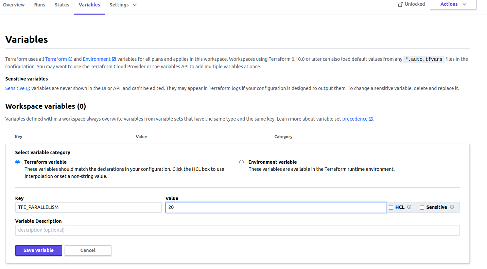

In my previous [post](../how-to-enable-debug-in-terraform-cloud/) I showed how to enable debug logs. Today I want to present how to improve `terraform plan` and `terraform apply` speed by configuring **parallelism**.

[Terraform](https://www.terraform.io/) by default runs `10` concurrent operations. To reduce execution time on plan or apply operation we can increase this parameter.
> By increasing **paralellism**  you can hist rate limit your provider. Some cloud providers (like [Cloudflare](https://developers.cloudflare.com/terraform/advanced-topics/provider-customization/#increase-the-frequency-of-api-requests)) informs about number of API request allowed in period of time. Hitting the limit can impact your deployments.

## `TFE_PARALLELISM` variable 
The easiest way to increase parallelism in Terraform Cloud for Remote Execution is `TFE_PARALLELISM` variable. It just require a number. To set this you need to perform those steps:

* Select your workspace,
* Go to **Variables** tab,
* Add variable in **Workspace variables** panel and create `TFE_PARALLELISM` variable:
  
  > Ensure you have selected **Environment variable** button  

The change should be available on next execution.

## Manage parallelism for each stage of execution

Terraform CLI allows to configure parallelism differently per each command(`terrafom plan`,`terraform apply` or `terraform destroy`). In Terraform Cloud we also can do this. In these cases, use `TF_CLI_ARGS_plan="-parallelism=<N>"` or `TF_CLI_ARGS_apply="-parallelism=<N>"` environment variables instead `TFE_PARALLELISM`.

I prefer this way because it allows to be more granular. I want to run plan fast because it makes request about every resource.

To set `TF_CLI_ARGS_plan="-parallelism=<N>"` or `TF_CLI_ARGS_apply="-parallelism=<N>"` parameters perform same steps as in instruction written above for `TFE_PARALLELISM`.

## Manage the variables in a single place
I showed how to configure variable per each workspace. Terraform Cloud allows to configure **Variable set** which can be attached to each workspace, and we don't need to repeat ourself for each workspace.

To configure **Variable set** do:
* Go to your organization **Settings**
* Select **Variable set** tab and click button **Create variable set**
* In **Variables** panel you need to define your variables

What left is to attach variables set to your workspace or you can enable this set to all workspaces in organization.

**Variables set** has lower precedence than workspace variables. Definition of the same variable in workspace will be used in execution. [Here](https://www.terraform.io/cloud-docs/workspaces/variables#precedence) you can read more.
