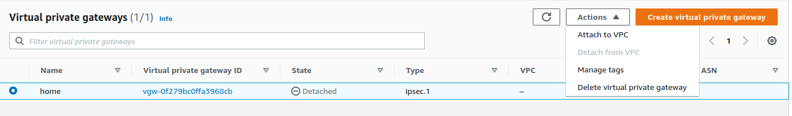
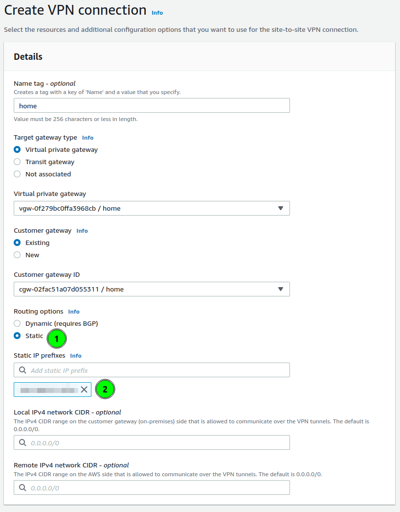
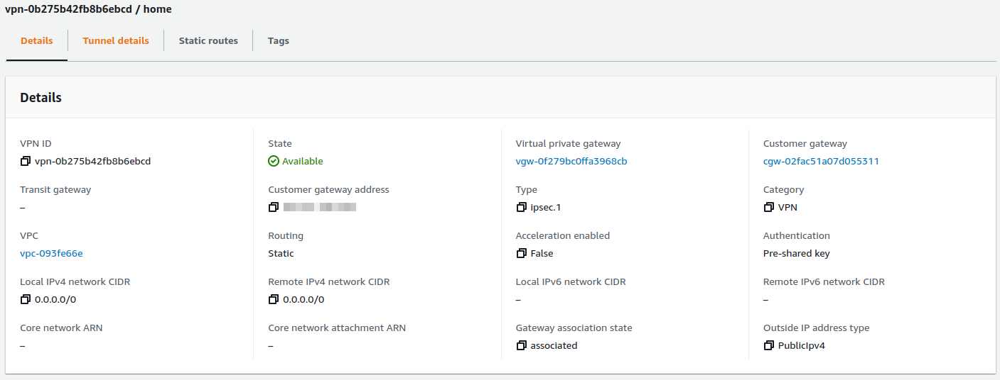
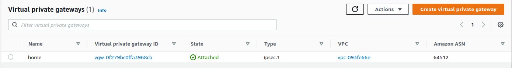
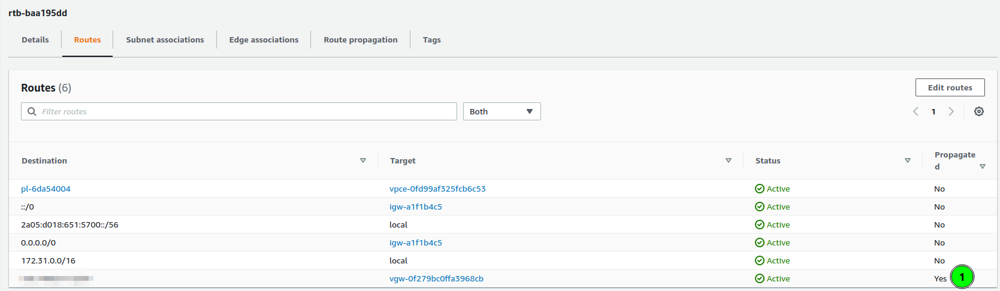
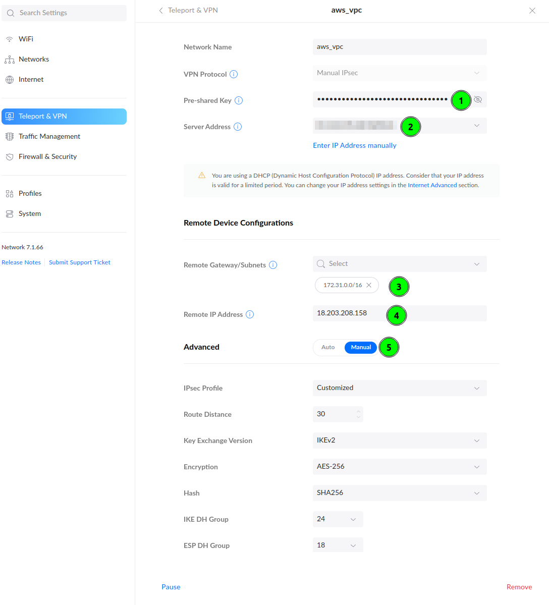

By default resources, you launch on the cloud (EC2, RDS, and others) cannot communicate with your local networks like home or office. To allow this you can create a Site-to-Site VPN. This VPN connection will be established between your router and AWS VPC.

Creating VPN between networks is [well documented](https://docs.aws.amazon.com/vpn/latest/s2svpn/SetUpVPNConnections.html). However, you can have issues configuring your home router. At home, I have Unifi Dream Machine router, which is designed for small networks, but have features which are matching advanced routers for offices. One of them is a Site-to-Site VPN using the IPSec protocol.

## Setup VPN on AWS ☁️

The first step is to create a VPN connection on AWS. For this blog I will use... the default VPC 🙂. To configure it AWS requires to define 3 components: Customer Gateway, Virtual Private Gateway and VPN connection.

The Customer Gateway is basically just an entity that holds the information about your home router - public IP.
The Virtual Private Gateway is the virtual entity on the VPC side, that allows to configure routing to that gateway. That VPG will is attached to the VPN. So the last entity is the VPN connection which brings it all together and establishes the VPN tunnels between your home or office and VPC.

### Create base components 🏗️

To start your VPN connection start by defining Customer Gateway.  
Go to the **VPC** tab, find panel **Customer Gateway** and click t button to **Create**. The required field is IP address. Write here your public IP address where your router is running. Also, it is good to name this gateway. I named my as `home`.

> To quickly check you public IP you can open  https://ifconfig.co 

The next step is to create Virtual Private Gateway. Go to the **Virtual Panel Gateway** panel and click **Create**. It just asks for a name. Let's name it also `home`. The VPG state will be detached. I will back to it later.



### Create a VPN connection 🔒

This is a time to start defining VPN.  Open the **Site-to-Site VPN connection** panel and click **Create VPN Connection**. The form will have 3 panels: details and tunnel options.

**Details** start from defining the gateway on the VPC side. Choose **Virtual private gateway** and in the form select your VPG.

Next select **Customer gateway**. Here you define with which router the VPN will be established.

There is the last configuration to set: routing. It is a section where you can define to which local networks will the VPN will be used. On the screenshot, I marked this as a point **1**.

AWS allows for two options. to configure routing dynamic, based on BGP. And statically defined. In my case, I am using static.   
In the prefixes, I am putting my local network prefixes(like `192.168.1.0/24`). You are allowed to put multiple networks here.



### Configure Tunnel Options ⚙️

Tunnel options are allowing to define the IPSec parameters. AWS creating a VPC creates 2 tunnels, to which you can connect and each of them you can configure differently. Or the same 🙂.

What I am always choosing is:
* **Encryption algorithms**: AES-256 (for both phases)
* **Integrity algorithms**: SHA2-256, SHA2-384, SHA2-512
* **DH groups**: all above 14
* **IKE Version**: ikev2

Those parameters will be crucial for setting up our Unifi router.

When you finish these changes you can create VPN and wait a few seconds. The VPN connection should be ready.


### Configure VPC Routing 🛣️

Previously I mentioned that the Virtual Private Gateway state is not attached to any VPC. We can reassign the VPN connection between VPCs by changing attachments.

To attach go back to **Virtual Private Gateway** and select your VPG and in **Actions**, button find **Attach to VPC**. Select your VPC and your VPG should be available to configure routing on VPC.


On VPC left the last thing to configure: routes. As we have assigned VPG, and networks from our home are known(are configured on VPN, with static routes), we can configure automated propagation of those rules to VPC route tables. To configure this perform:

1. Go to **Route tables**
2. Select routes assigned to VPC, or those which should have access to your home.
3. Select **Actions** button, and choose **Edit route propagation**,
4. Select Virtual private gateway

After a few seconds, the new route should be added

As you can see, the last route is "Propagated", and it's target is my virtual private gateway.

## Setup VPN on Unifi 🏠
Having configured AWS VPC, left the part to configure our router. In my home, I have Unifi Dream Machine, with the latest software (Network 7.1). 

To create a VPN connection:
* Go to **Settings** > **Teleport & VPN**,
* Scroll down to **Site-to-Site VPN** and click  **Create**,


Start filling out form. The Pre-Shared Key you could configure on Tunnel Options. If you have skipped this, go to the AWS VPN tab, and click **Download Configuration**. In his file you will find PSK to fill in point 1 and the **Remote IP Address**(point 4).
In the **Remote Gateway/Subnets**(point 3) put AWS VPC network addressing. In my case, it was `172.31.0.0/16`.

To align encryption options to **Tunnel Options** on AWS, select **Manual** in Advanced configuration and customize. Configure your parameters accordingly to this how you have configured them. I am recommending using **AES-256** and higher DH Groups and use above image as an example..


The VPN connection should be established ❤️


## Last step - testing 🪛
To check if you have a working VPN connection create an EC2 instance on this VPC. 


Ensure your Security group allows for your home network. You can allow access to a single port, protocol, or whole traffic.


I have created an instance with IP `172.31.34.95`. This instance has a Security Group rule allowing for **All Traffic** from my home network.
When the VPN works and instance is up, a simple `ping` can prove that everything is configured:
```bash
$ ping 172.31.34.95 -c 5
PING 172.31.34.95 (172.31.34.95) 56(84) bytes of data.
64 bytes from 172.31.34.95: icmp_seq=1 ttl=63 time=38.1 ms
64 bytes from 172.31.34.95: icmp_seq=2 ttl=63 time=38.2 ms
64 bytes from 172.31.34.95: icmp_seq=3 ttl=63 time=36.4 ms
64 bytes from 172.31.34.95: icmp_seq=4 ttl=63 time=38.3 ms
64 bytes from 172.31.34.95: icmp_seq=5 ttl=63 time=38.1 ms

--- 172.31.34.95 ping statistics ---
5 packets transmitted, 5 received, 0% packet loss, time 4005ms
rtt min/avg/max/mdev = 36.380/37.810/38.285/0.718 ms
```

> If you are not sure that you are pinging EC2 take a look on ping response times. On local networks they are much lower.

## Summary ☑️

Setting up VPN allows to make your infrastructure secure. You don't have to expose ports on public internet to have access to cloud machines.

## FAQ ❓

**I have two network VLANs at home, should I configure some firewall rules if I don't want to allow access from one of them?**

Let's assume you have two networks: `home` and `guest`.  If the `guest` network should not have access to resources to VPN, on AWS VPN,  in **Static IP Prefixes** configuration you have to set only `home` network subnet.

Another thing are Security Groups, where we define allowed networks. If you will not set too wide network range, then it will also block access.

