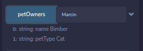

## First contract - Pet owners

I am learning blockchain and smarcontract. This post will be my note how I am starting my journey to blockchain technology.

In this example I will create a contract for storing who is owning a Pet.

## Development

```solidity
// SPDX-License-Identifier: MIT
pragma solidity ^0.8.0; //build contract on top of Solidity >=0.8.0 and <0.9.0

contract PetOwner {
    mapping (string => Pet) public petOwners;

    struct Pet {
        string name;
        string petType;
    }

    function addPetOwner(string memory ownerName, string memory _name, string memory _petType) public {
        petOwners[ownerName] = Pet({name: _name, petType: _petType});
    }

}
```

Put it to the Remix IDE: https://remix.ethereum.org/. It should compile and we can deploy it on local environment:


When we have contract deployed we can create example contract ownership


and ask `petOwners` field for information which Pet is owned by `Marcin`.



## Let's deploy it to Ethenerum test network

Ethenerum allows to test our contract test networks. For this example I will use Rinkeby. This a free and for testing smart contracts network.

> I am not covering how to install Metamask. Always remember to not share **private key** and **seed**
> You can always create a new Metamask identity for the your tests.

1. Switch the Remix Environment from `Javascript VM` to `Injected Web3`
2. Connect your Metamas. Ensure you have choosen Rinkeby network

3. If you dont have any `ETH` coins you can use this Faucet to grab some: https://faucets.chain.link/rinkeby
4. Click deploy. You will be asked by Metamask to confirm the transaction: [Contract deployment transaction](https://rinkeby.etherscan.io/tx/0x60ad0e4b25ba4dadef1410d766222b30815fe9e6bc7168cd6cd0f205bb4d90e3)

Now I can test my contract. I fill the data


And we will be asked again for confirming the transaction
.

When everything will be done, our transaction should be visible on [Etherscan](https://rinkeby.etherscan.io/tx/0x5d53899e2cfc1ce5afa597f5073792d06fbceeaa0d3c9d78ccde57e714f28b7d)


And at the end we can check if `petOwner` field contains our definition:


---
_This post are my notes from Blockchain development tutorial availale [here](https://www.youtube.com/watch?v=M576WGiDBdQ)._
