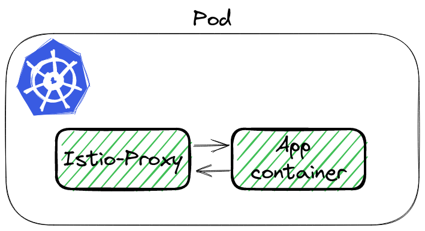
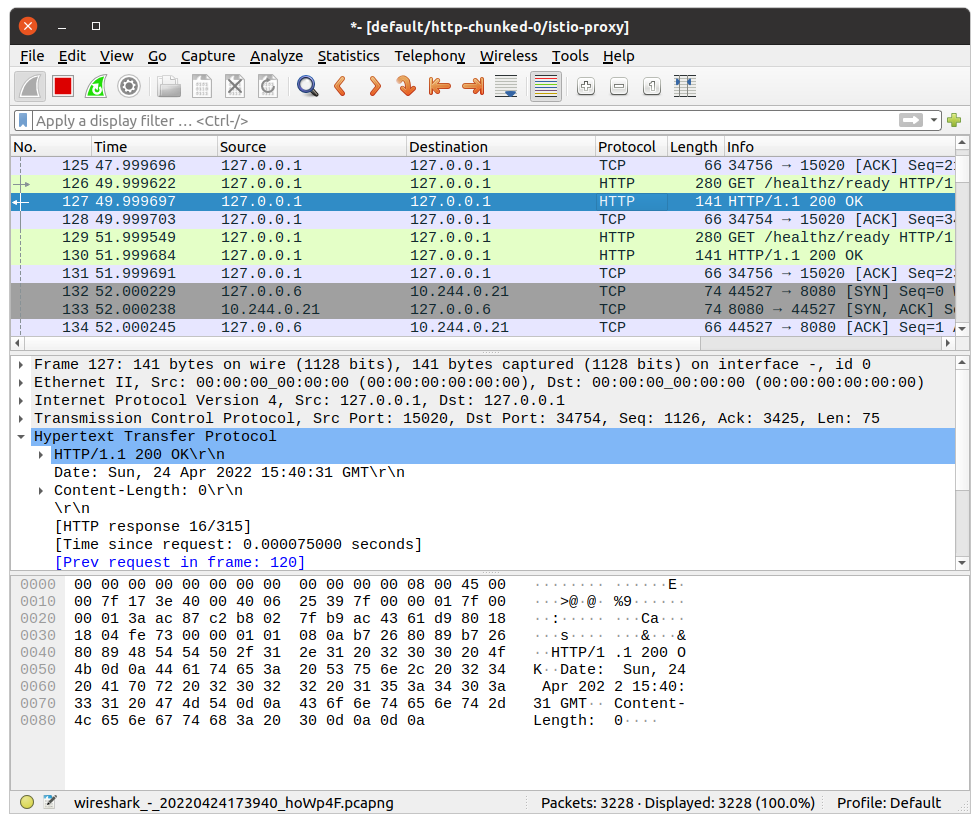
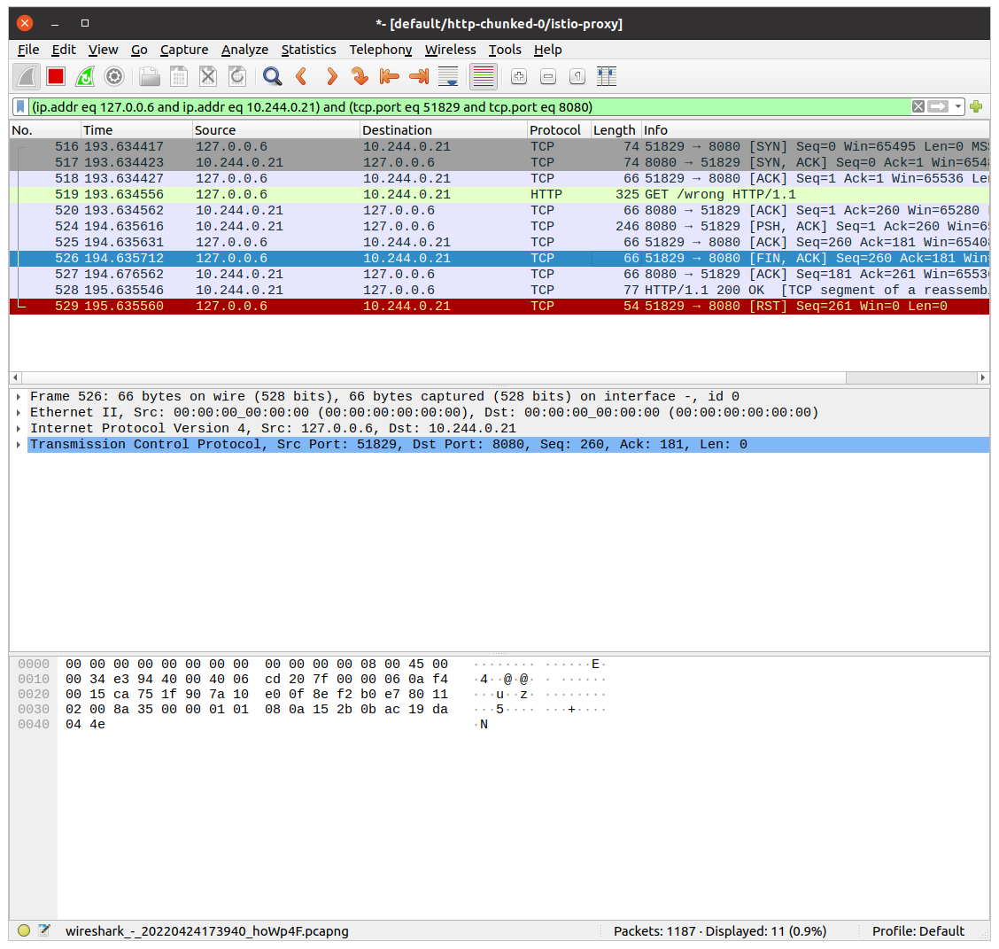
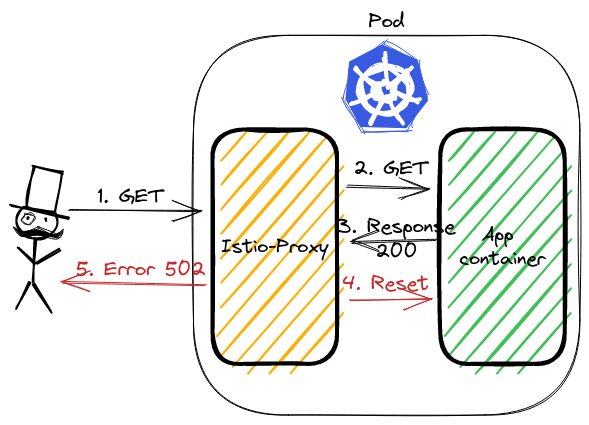
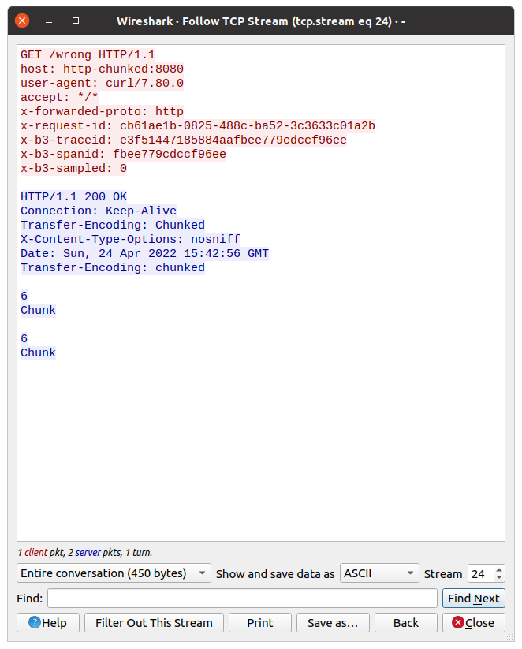

[Istio](https://istio.io) is a complex system. For the applications, the main component is the sidecar container Istio-Proxy, which proxies while traffic from all containers in Pod. And this can lead to some issues.

This post describes one of the most complicated problems I have encountered in my career.

## The problem - Connection Reset 🐛

During Istio on a huge system, with more than different 40 microservices, on a single endpoint, QA engineers found a bug. It was POST endpoint, which was returning chunked data.

Istio was returning error 502, in logs were visible additional flag: `upstream_reset_before_response_started`. The application logs were confirming, that the result was correct.

> In legacy Istio versions of the presented problem Istio were returning `503` error with `UC` flag.

## Analyzing issue ⛏️

Lest see the  `curl` response and look at Istio-proxy logs:

```bash
kubectl exec -it curl-0 -- curl http://http-chunked:8080/wrong -v
< HTTP/1.1 502 Bad Gateway
< content-length: 87
< content-type: text/plain
< date: Sun, 24 Apr 2022 12:28:28 GMT
< server: istio-envoy
< x-envoy-decorator-operation: http-chunked.default.svc.cluster.local:8080/*
upstream connect error or disconnect/reset before headers. reset reason: protocol error

$ kubectl logs http-chunked-0 -c istio-proxy
[2022-04-24T12:23:37.047Z] "GET /wrong HTTP/1.1" 502 UPE upstream_reset_before_response_started{protocol_error} - "-" 0 87 1001 - "-" "curl/7.80.0" "3987a4cb-2e0e-4de6-af66-7e3447600c73" "http-chunked:8080" "10.244.0.17:8080" inbound|8080|| 127.0.0.6:39063 10.244.0.17:8080 10.244.0.14:35500 - default
```

## Time for spying 🕵🏻‍♂️

To analyze the traffic we can use `tcpdump` and Wireshark. Istio-proxy runs as a sidecar, which routes whole incoming and outgoing traffic to pod through own proxy.


To sniff traffic there are 3 ways:

1. Running tcpdump in `istio-proxy` container,
2. Using `kubectl` plugin `ksinff`  - a plugin to kubectl to dump packets from pod, [github repo](https://github.com/eldadru/ksniff),
3. Adding additional container to pod, with `root` permission and `tcpdump`  installed,

First will not work by default, because `istio-proxy` runs without root permission. The third is the backup if 1 and 2 would not work. Let's try [ksniff](https://github.com/eldadru/ksniff).

### What is ksniff 🛠️

`ksniff` in three words is a plugin that:

* figures  out what node is running pod with an app,
* deploys an own pod with an affinity to that node, bound to the host network,
* opens Wireshark on your laptop with a packet stream from the application.

Let's execute it to sniff our application:

```bash
kubectl sniff http-chunked-0 -c istio-proxy -p -f '-i lo' -n default
```

> **Important parameters**
>
> * `-p` is parameter to support sniffing even if the pod is non-priviledged. See [docs](https://github.com/eldadru/ksniff#non-privileged-and-scratch-pods),
> * `-f '-i lo'` passes filter to tcpdump, we want to sniff localhost interface inside the Pod.

If there is no issue, our system has Wireshark in `PATH`, `ksniff` should open a new window


### Finding the root cause 🔎

Wireshark will continuously follow with new packet records. It makes it hard to figure out our particular call. We can youse filters to help with searching. Knowing the request path, method, response code - we can use it to find our packet using filter:

```bash
http.request.uri == "/wrong"
```

It shows only a single packet, our request. Wireshark allows to show the whole TCP conversation:

* click right click on the packet,
* go to `Conversation Filter`,
* select `TCP`.

Wireshark will write a filter to show the whole communication between istio-proxy container and the application container!



Let's see the above image. The first 3 records are the three-way handshake packets. Later is our GET request.  The most interesting happens in the last two packets. Application container returns response HTTP 200 OK. `istio-proxy` then closes the connection with `RST` packet.



This is what we saw in the logs. The flag was `upstream_reset_before_response_started{protocol_error}`. But why? This still does not explain.

### Swiss knife by Wireshark 🪛

It is hard to read the HTTP protocol from multiple packets bodies. But also there Wireshark has a solution. We can see data from L7, the application one. In our case, it is the HTTP protocol.

Click with the right mouse on a single packet, go to the `Follow` tab, and select `TCP Stream`:



Now we can check what the request from `istio-proxy` looked like, and what was the response from the app.
Do you have an idea from the above picture?

Look closer at the response, there is a double `Transfer-Encoding` header. One starts from uppercase, the second one does not.

### Double transfer-encoding header - what does it mean❔

Searching over Istio issues I found [this answer](https://github.com/istio/istio/issues/24753#issuecomment-656380098). The most important are first 2 points:

> 1. two `transfer-encoding: chunked` is equivalent to `transfer-encoding: chunked, chunked` as per RFC,
> 2. `transfer-encoding: chunked, chunked` doesn't have the same semantic as `transfer-encoding: chunked`

Why the response was taken as double-chunked? According to [Transfer Codings in Section 4](https://datatracker.ietf.org/doc/html/rfc7230#section-4), transfer-coding names **are case-insensitive**.

## Summary 📓

As you see, Istio stands as a guard 👮‍♂️ of the HTTP protocol. If the app is returning a double-chunked response, then Istio requires it, otherwise, it rejects processing the request. `curl` ignores this inconsistency.

This issue was one of the most difficult tasks, which I ever had :-)

## Infrastructure to reproduce and example app 🏭

In [Github repository](https://github.com/mjasion/istio-upstream-reset) I created example infrastructure to reproduce the problem.

Bootstrap of the infrastructure installs ArgoCD, Istio and the App. The sample app exposes two endpoints:

* `/correct` - endpoint, which creates a streamed response,
* `/wrong` - is doing same as above, but additionally it set value of the `Transfer-Encoding` header to `Chunked`(uppercase).

---
_I would like to thank [Przemysław](https://www.linkedin.com/in/przemyslaw-ozimkiewicz/) for his help and for showing me how to use Wireshark efficiently during this issue.🤝🏻_
