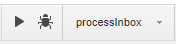
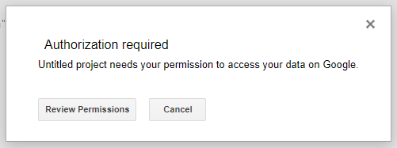
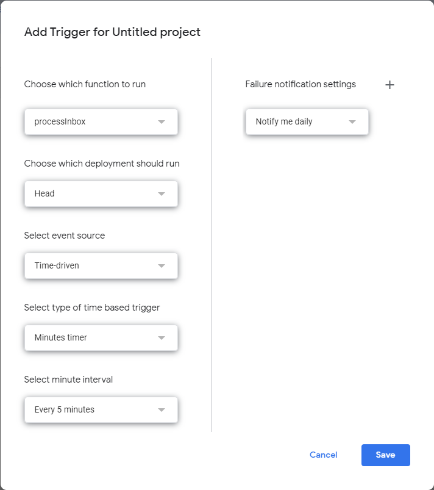
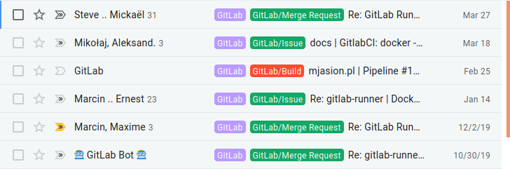

## 📨 How GitLab sends notifications?

GitLab allows you to stay informed about what’s happening in your projects sending you the notifications via email. With enabled notifications, you can receive updates about activity in issues, merge requests or build results. All of those emails are sent from a single address which without a doubt makes it harder to do successful filtering and labeling.

However GitLab adds custom headers to every sent notification to allow you to better manage received notification and for example, you could add a label to all emails with pipelines results to mark them as important. Similarly, you could make the same scenario for notification about the issue assigned to you. Some of the headers that you can find in emails are:
<center>

|Header name|Reason of message|
|:-|:-|
| `X-GitLab-Project` | Notification from project |
| `X-GitLab-Issue-ID` | Notification about a change in **issue**. |
| `X-GitLab-MergeRequest-ID` | Notification about a change in **merge request**. |
| `X-GitLab-Pipeline-Id` | Notification about the **result of pipeline**. |

</center>

As can be seen above headers allow you to create example condition: if the email contains the header `X-GitLab-Issue-ID` then add a label “GitLab Issue”.

Of course, there are more headers available. The full list of headers, which GitLab can include to emails is available in the section “[Filtering email](https://docs.gitlab.com/ee/user/profile/notifications.html#filtering-email)” of GitLab documentation. Every header also contains a value. Some headers contain an ID, some contain names of projects. You can check out them in the documentation.


## 📥 How to filter emails in Gmail by header?

To automatically add labels in Gmail you have to create a filter. However, it does not allow to filter by headers. But this is not impossible.

Google provides a special service called Google Apps Scripts. It allows you to write short scripts in TypeScript language, where you can extend default Gmail filtering.

## ⌨️ How can I add a label to message by headers?

Firstly you have to begin with function, which will be scheduled to query for new emails in the inbox and will execute further message processing:

```js
function processInbox() {
   // process all recent threads in the Inbox
   var threads = GmailApp.search("newer_than:1h"); // search query is exactly same as in Gmail search box
   for (var i = 0; i < threads.length; i++) {
      // get all messages in a given thread
      var messages = threads[i].getMessages();
      for (var j = 0; j < messages.length; j++) {
         var message = messages[j];
         processMessage(message); // function to process the message 
      }
   }
}
```

As you see, the code is pretty simple. It uses `search()` function from [GmailApp](https://developers.google.com/apps-script/reference/gmail) which allows you to interact with Gmail service. The result of the function is a list of threads from the last hour. After that we have to get the message content. We can do it by writing a loop to get every message from a thread. The `getMessages()` function returns a list o [Gmail Messages](https://developers.google.com/apps-script/reference/gmail/gmail-message) objects. Having them we can implement our actions basing on the content.

To do that you have to call `getRawContent()` function on the message object and check if the message contains a string that you are looking for. For example to check that this is a message send by GitLab find in the body string `"X-GitLab"`:

```js
var gitlabLabel = GmailApp.getUserLabelByName("GitLab"); 
var body = message.getRawContent(); 
if (body.indexOf("X-GitLab") > -1) { 
  message.getThread().addLabel(gitlabLabel); 
}
```

Now we can implement the `processMessage(message)` function adding other conditions and putting it below `processInbox()`. As a result, we will get a full script, which will look like this:

```js
function processInbox() {
   // process all recent threads in the Inbox (see comment to this answer)
  var threads = GmailApp.search("newer_than:1h");
  Logger.log(threads.length)
   for (var i = 0; i < threads.length; i++) {
      // get all messages in a given thread
      var messages = threads[i].getMessages();
      for (var j = 0; j < messages.length; j++) {
         var message = messages[j];
         processMessage(message);
      }
   }
}

function processMessage(message) {
  // Get label instances
  var gitlabLabel = GmailApp.getUserLabelByName("GitLab");    
  var issueLabel = GmailApp.getUserLabelByName("Gitlab/Issue");
  var mrLabel = GmailApp.getUserLabelByName("Gitlab/Merge request");
  var buildLabel = GmailApp.getUserLabelByName("Gitlab/Build");
  var commitLabel = GmailApp.getUserLabelByName("Gitlab/Commit");  
  var discussionLabel = GmailApp.getUserLabelByName("Gitlab/Discussion");  

  // Start message processing
  var body = message.getRawContent(); 
  if (body.indexOf("X-GitLab") > -1) { 
     message.getThread().addLabel(gitlabLabel); 
  }
  if (body.indexOf("X-GitLab-Issue-ID") > -1) {
    message.getThread().addLabel(issueLabel);
  }
  if (body.indexOf("X-GitLab-MergeRequest-ID") > -1) {
    message.getThread().addLabel(mrLabel);
  }
  if (body.indexOf("X-GitLab-Commit-ID") > -1 || body.indexOf("X-GitLab-Author-ID") > -1) {
    message.getThread().addLabel(commitLabel);
  }
  if (body.indexOf("X-GitLab-Author") > -1) {
    message.getThread().addLabel(commitLabel);
  }
  if (body.indexOf("X-GitLab-Pipeline-Id") > -1) {
    message.getThread().addLabel(buildLabel)
  }
}
```

> You have to create labels before running the function. Otherwise, your script will throw an error.

## ▶️ How to turn on the script processing for you Gmail inbox?

1. Go to [Google Apps Scripts](https://script.google.com/home).
2. Create a new project, put your code and save.
3. From the Web IDE you can perform the execution to check for errors. Select function `processInbox` and click Play button:


4. You will be asked to permit a project access to your Gmail data. Choose your account:


5. After successful authorization, you can re-run the project. It will be immediately executed.
6. When there is no errors, create a custom trigger. Find button: 

7. Click “Add trigger” button at the bottom of the page.
8. Select function `processInbox` and configure the time source. The execution frequency depends is your choice. If you receive a lot of messages and you will run this script every 1 minute you can hit the limits. In the above script, I am scanning for emails from the last hour so the script can be executed at least once an hour.  


## 🏁And that’s it!

Google should now start executing your script and checking for new emails to make actions which you just implemented. The result of running this script is to label new emails from GitLab as you want 🤗.



## 📖 Summarize

Gmail filters are sufficient for most user’s usage. However, if your use case is more advanced then for help arrives Google Apps Scripts. It doesn’t require deep programming knowledge and searching in Google you can solve your problems. Summing up remember that you can have multiple scripts to process your inbox, and you can

Did you know about Google App Scripts before? Please share how are you using them in the comments below.