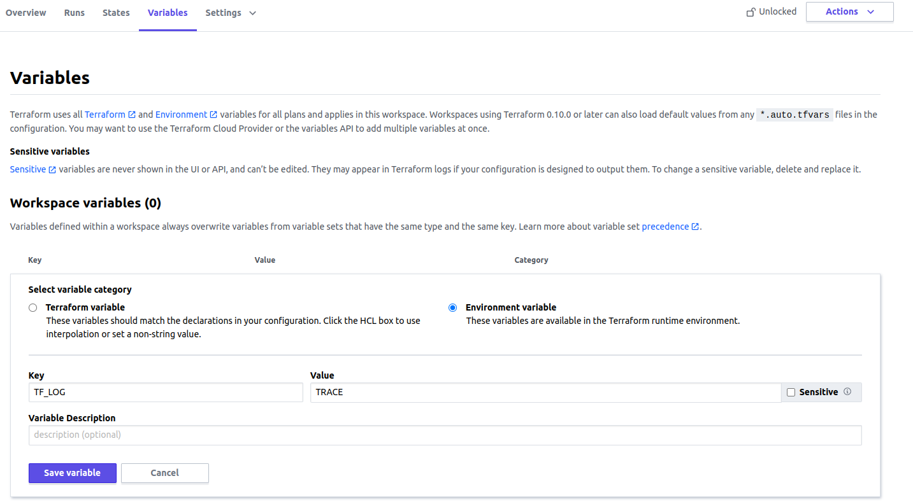

[Terraform Cloud](https://cloud.hashicorp.com/products/terraform) is an application that helps teams use Terraform together. I am using it for side projects like my cloud infrastructure. Last time I had to see trace logs to find an issue with one of the managed resources.

[Terraform](https://www.terraform.io/) has detailed logs which can be enabled by setting the `TF_LOG` environment variable to any value. This will cause detailed logs to appear on execution.

## Enabling verbose logging in CLI

You can set `TF_LOG` to one of the log levels `TRACE`, `DEBUG`, `INFO`, `WARN` or `ERROR` to change the verbosity of the logs. You can set this variable in two ways. First option is to set variable for shell session:

```bash
$ export TF_LOG=TRACE
$ terraform plan
```
Second option is to change variable before command execution
```bash
$ TF_LOG=TRACE terraform plan
```

## Enabling logging in Terraform Cloud
If this run is in Terraform Cloud or Terraform Enterprise with Remote Execution, perform these steps:

* Select your workspace,
* Go to **Variables** tab,
* Add variable in **Workspace variables** panel and create `TF_LOG` variable:
  
  > Ensure you have selected **Environment variable** button
* Perform the run that you want to trace

### Another option is to enable local execution
If you are working on your own project, it will be much more convenient to disable Remote Execution and execute the run locally. Go to workspace **Settings** and in **Execution Mode** panel switch the button to **Local**. Then you can run plan from your local machine.

* * *
Once the issue is resolved, unset the `TF_LOG` environment variable to disable the enhanced logging.
